# 引言
当应用程序需要更多内存时，它们可以在运行时从堆上分配（而非栈上），这种内存被称为“动态内存”，因为它在编译时无法预知，且其需求会在程序执行过程中变化。在我的项目中，我采用了自定义的内存分配策略，而不是使用标准的 `malloc` 和 `free` 函数，这样做是为了提高内存管理的效率。

我的目标是深入理解最常见的内存分配器的工作原理，评估它们的优势，并进行比较以确定哪一种的性能更优。

# Malloc的缺点
- **通用性**：作为一个通用工具，它必须能够应对各种情况（从1字节到1GB或更多）。因此，它的实现并不像为特定需求定制的那样高效。
- **速度慢**：有时，malloc 在分配内存时需要在用户模式和内核模式之间切换，以从系统中获取更多内存。这会显著降低其性能。

# 自定义分配器
由于每个程序都有其特定的需求，使用通用分配器并不明智。我选择了最适合我的项目的分配器，从而提升了**性能**。

通常，自定义分配器具有以下特点：
- **减少malloc调用次数**：任何自定义分配器都尽量减少malloc的调用。为此，它们会一次性分配**大块内存**，然后内部管理这些内存块，以提供更小的内存分配。
- **数据结构**：使用辅助数据结构如**链表**、**树**、**栈**来管理这些大块内存。这些结构通常用于快速跟踪内存的已分配和空闲部分。
- **限制**：某些分配器非常特定，并对可以执行的数据或操作有限制。这使得它们能够实现高性能，但只能在特定应用程序中使用。

## 线性分配器
这是最简单类型的分配器。它通过维护一个指向内存块起始地址的指针，并在每次分配时移动它。这种分配器将内部碎片最小化，因为所有元素都是顺序（空间局部性）插入的，它们之间的唯一碎片是因对齐而产生的。

### 数据结构
这个分配器只需要一个指针（或偏移量）来指示上次分配的位置。它不需要任何额外的信息或数据结构。

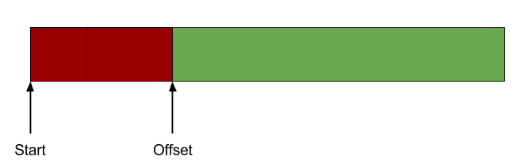

_复杂度: **O(1)**_

### 分配
只需简单地向前移动指针（或偏移量）。

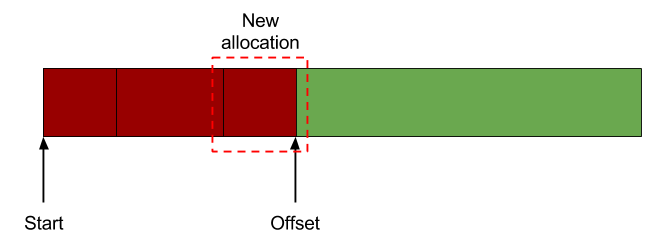

_复杂度: **O(1)**_

### 释放
由于其简单性，这种分配器不允许特定位置的内存被释放。通常，所有内存会一次性被释放。

### 适用场景
线性分配器适用于需要快速且聚合内存分配的场景，其中分配模式相对固定，且不需要频繁的单独释放。例如，在游戏或3D可视化程序中加载新场景时，可以使用线性分配器为场景中的所有对象分配内存。

## 栈分配器
这是我对线性分配器的改进。它将内存管理为栈。与线性分配器类似，我保留了一个指向当前内存地址的指针，并在每次分配时向前移动它。然而，当执行释放操作时，我也可以向后移动它。这种方式同样保持了空间局部性原则，并将碎片保持在较低水平。

### 数据结构
为了能够释放内存，我需要在每次分配时存储一个标头，该标头指示分配块的大小。这样，当我释放内存时，我知道需要将指针向后移动多少。

_复杂度: **O(N*H) --> O(N)**_ 其中 H 是标头大小，N 是分配数量

### 分配
简单地向前移动指针（或偏移量），并在内存块之前放置一个标头，指示其大小。

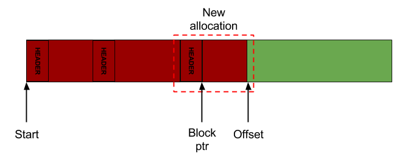

_复杂度: **O(1)**_

### 释放
简单地从标头中读取块大小，并按照该大小将指针向后移动。

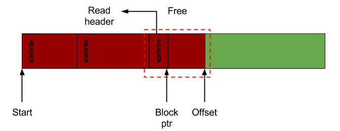

_复杂度: **O(1)**_

### 适用场景
在游戏开发中，对象如子弹或临时效果可能会频繁生成和销毁。栈分配器，凭借其快速的内存分配和释放能力，非常适合这类场景。

## 池分配器
池分配器与前两者有很大不同。它将大块内存分割成相同大小的小块，并跟踪哪些是空闲的。当请求分配时，它返回一个空闲块的大小。当执行释放时，它简单地存储它以供下次分配使用。这样，分配工作非常快，碎片仍然非常低。

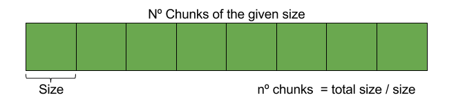

### 数据结构
为了跟踪空闲内存块，池分配器使用链表链接每个空闲内存块的地址。

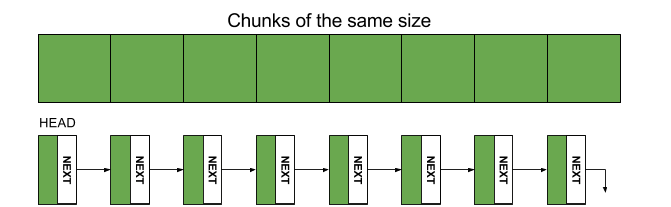

为了减少空间需求，这个**链表存储在相同的空闲块**中。这要求数据块至少和链表节点一样大，以便我们可以在空闲内存块中存储链表。

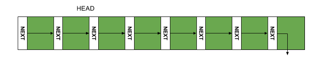

_复杂度: **O(1)**_

### 分配
分配意味着简单地取（弹出）链表中的第一个空闲块。

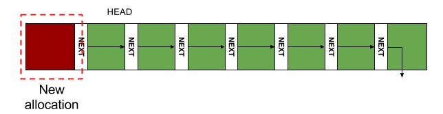

链表不需要排序。其顺序由分配和释放的操作方式决定。

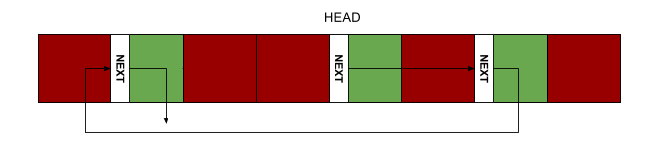

_复杂度: **O(1)**_

### 释放
释放意味着将释放的元素添加（推送）为链表中的第一个元素。

_复杂度: **O(1)**_

## 自由列表分配器

这是一个通用分配器，与其它分配器不同，它不施加任何限制。它允许在任何顺序中进行分配和释放。因此，它的性能可能不如之前的分配器。根据用于加速此分配器的数据结构，有两种常见的实现：一个使用链表，另一个使用红黑树。

### 链表数据结构
这种实现使用链表以排序的方式存储每个空闲连续内存块的起始地址及其大小。
当请求分配时，我在链表中搜索一个可以容纳数据的块。然后从链表中移除该元素，并在数据之前放置一个分配头部（用于释放）。
在释放时，我从头部获取有关分配的信息。然后，我将释放的块插入到排序的链表中，并尝试合并连续的内存块以创建更大的块。

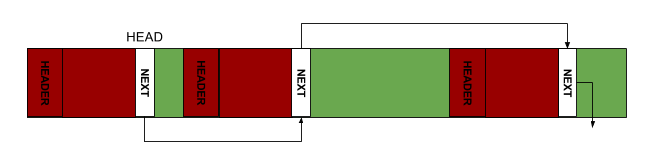

_复杂度: **O(N*HF + M*HA)--> O(M)**_ 其中 N 是空闲块的数量，HF 是空闲块头部的大小，M 是已分配块的数量，HA 是已分配块头部的大小

### 链表分配
当请求分配时，我寻找一个可以容纳数据的内存块。这意味着我必须遍历链表，直到找到一个大小足够大的块（可以存储数据和分配头部）并从链表中移除它。

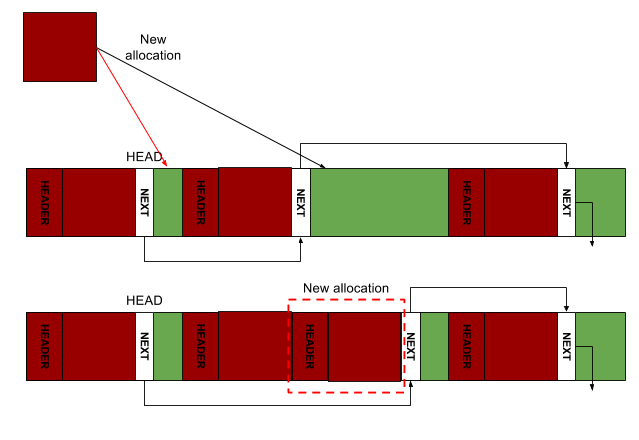

_复杂度: **O(N)**_ 其中 N 是空闲块的数量

### 链表释放
首先，我从头部获取有关分配的信息。然后，我遍历链表，将空闲块插入到正确的位置（因为它是按地址排序的）。插入后，我合并连续的块。合并连续内存块以创建更大块的操作称为**合并**。

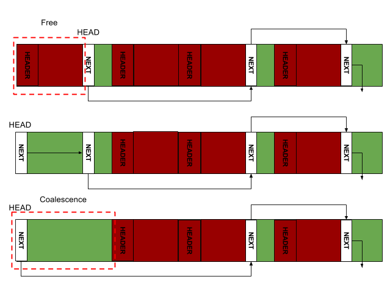

_复杂度: **O(N)**_ 其中 N 是空闲块的数量

# 基准测试
我进行了几种不同的基准测试，包括不同的区块大小、操作数量、随机顺序等。时间基准测试度量了从初始化分配器（分配大块内存，设置额外的数据结构...）到执行最后一次操作（分配或释放）所需的执行时间。

在这里，我只展示与本项目目标相关的部分。

## 时间复杂度
* **Malloc** 无疑是表现**最差的分配器**。这是由于它的通用性和灵活性。 _**O(n)**_
* **自由列表分配器** 是一个比 malloc **更好的通用分配器选择**。它使用链表来加速分配/释放。它大约是 malloc 的三倍快 _**O(n)**_

接下来的分配器表现得更好，但它们不再是通用分配器。它们**对使用方式有限制**：
* **池分配器** 强制我们总是分配相同大小的内存块，但我们可以按任何顺序分配和释放。这个分配器的复杂度比自由列表分配器略好，等等，池分配器的复杂度应该是常数而不是线性的！确实如此。这里发生的情况是，附加数据结构（链表）的初始化是 _**O(n)**_。它必须在链表中创建所有内存块并将它们链接起来。这个操作掩盖了分配和释放操作的真实复杂度，即 _**O(1)**_。因此，在评估池分配器（以及所有分配器）时，要考虑到初始化过程，以避免这种行为。
* **栈分配器** 可以分配任何大小的内存，但释放必须按照后进先出（LIFO）的顺序进行，复杂度为 _**O(1)**_。图表中的复杂度并不完全恒定，这是由于初始化函数必须分配第一个大块内存，就像池分配器一样。
* **线性分配器** 是最简单也是性能最好的分配器，复杂度为 _**O(1)**_，但它也是最有限制性的，因为不允许单个释放操作。

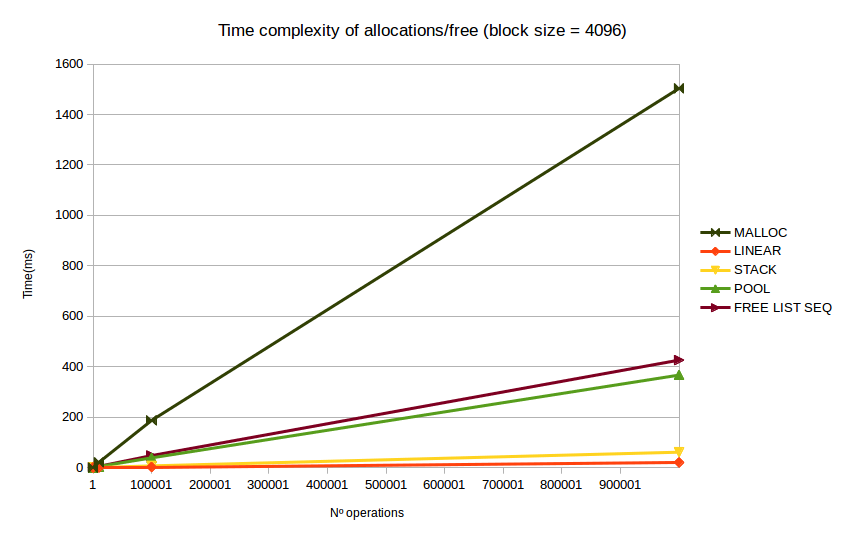

# 总结
这是一个简要的总结，描述了何时应该使用每种分配器。从限制性更强、效率更高的分配器到效率较低、更通用的分配器。

* **线性分配器**。若数据没有特定的结构，但存在一个共同的行为模式：所有数据在一定时间后都会“过期”，然后不再有用，因此可以被释放。游戏场景，可以使用线性分配器在一帧中分配数据，并在下一帧开始时释放所有数据。
* **栈分配器**。与线性分配器相同，但如果按后进先出（LIFO）的方式释放元素更有用。
* **池分配器**。数据具有明确的结构，所有数据元素的大小都相同。这是最佳选择，快速且无碎片。
* **自由列表分配器**。这个分配器允许你随意分配和释放内存。这是一个通用分配器，比 malloc 表现更好，但由于其灵活性，不如前面的分配器好。
# Introduction
When applications need more memory this can be allocated in the heap (rather than in the stack) in _runtime_. This memory is called 'dynamic memory' because it can't be known at compile time and its need changes during the execution. Our programs can ask for dynamic memory usin 'malloc'. Malloc returns an address to a position in memory where we can store our data. Once we're done with that data, we can call 'free' to free the memory and let others processes use it.

For this project I've implemented different ways to manage by ourselves dynamic memory in C++.This means that instead of using native calls like 'malloc' or 'free' we're going to use a custom memory allocator that will do this for us but in a more efficient way.
The goal, then, is to understand how the most common allocators work, what they offer and compare them to see which one performs better.

# What's wrong with Malloc?
* **General purpose**: Being a general purpose operation means that it must work in all cases (from 1byte to 1GB or more...). For this reason the implementation is not as efficient as it could be if the needs were more specific.
* **Slow**: Sometimes, when allocating memory, malloc needs to change from user to kernel mode to get more memory from the system. When this happens, malloc turns out to be super slow!

# Custom allocators
Because every program has specific needs, it makes no sense to use a general purpose allocator. We can choose the right allocator that works best for us. This way we can increase our **performance**.

In general, custom allocators share some features:
* **Low number of mallocs**: Any custom allocator tries to keep the number of mallocs low. To do that, they malloc _big chunks of memory_ and then, they manage this chunk internally to provide smaller allocations.
* **Data structures**: Secondary data structures like _Linked Lists_, _Trees_, _Stacks_ to manage these big chunks of memory. Usually they are used to keep track of the allocated and/or free portions of memory to _speed up_ operations.
* **Constraints**: Some allocators are very specific and have constraints over the data or operations that can be performed. This allows them to achieve a high performance but can only be used in some applications. 

## Linear allocator
This is the simplest kind of allocator. The idea is to keep a pointer at the first memory address of your memory chunk and move it every time an allocation is done. In this allocator, the internal fragmentation is kept to a minimum because all elements are sequentially (spatial locality) inserted and the only fragmentation between them is the alignment.

### Data structure
This allocator only requires a pointer (or an offset) to tell us the position of the last allocation. It doesn't require any extra information or data structure.

_Complexity: **O(1)**_

### Allocate
Simply move the pointer (or offset) forward.

_Complexity: **O(1)**_

### Free
Due to its simplicity, this allocator doesn't allow specific positions of memory to be freed. Usually, all memory is freed together.

### Applicable scenarios
LinearAllocator is suited for scenarios that require fast and aggregated memory allocation, where the allocation pattern is relatively fixed, and there's no need for frequent individual deallocations. This allocator, with its straightforward management approach (simply advancing an offset), offers efficient memory allocation.
In applications such as games or 3D visualization programs, when loading a new scene, a LinearAllocator might be used to allocate memory for all objects in the scene

## Stack allocator
This is a smart evolution of the Linear Allocator. The idea is to manage the memory as a Stack. So, as before, we keep a pointer to the current memory address and we move it forward for every allocation. However, we also can move it backwards when a free operation is done. As before, we keep the spatial locality principle and the fragmentation is still very low.

### Data structure
As I said, we need the pointer (or offset) to keep track of the last allocation. In order to be able to free memory, we also need to store a _header_ for each allocation that tell us the size of the allocated block. Thus, when we free, we know how many positions we have to move back the pointer. 

_Complexity: **O(N*H) --> O(N)**_ where H is the Header size and N is the number of allocations

### Allocate
Simply move the pointer (or offset) forward and place a header right before the memory block indicating its size.

_Complexity: **O(1)**_

### Free
Simply read the block size from the header and move the pointer backwards given that size.

_Complexity: **O(1)**_

### Applicable scenarios

Object management in game development: In game loops, objects such as bullets or temporary effects may be frequently generated and destroyed. StackAllocator, with its ability for rapid memory allocation and deallocation, is very suitable for this type of scenario.

## Pool allocator
A Pool allocator is quite different from the previous ones. It splits the big memory chunk into smaller chunks of the same size and keeps track of which of them are free. When an allocation is requested it returns the free chunk size. When a freed is done, it just stores it to be used in the next allocation. This way, allocations work super fast and the fragmentation is still very low.

### Data structure
To keep track of the free blocks of memory, the Pool allocator uses a Linked List that links the address of each free memory block. 

To reduce the space needed, this **Linked List is stored in the same free blocks** . However, this set the constraint that the data chunks must be at least as big as our nodes in the Linked List (so that, we can store the Linked List in the free memory blocks).

_Complexity: **O(1)**_ 

### Allocate
An allocation simply means to take (pop) the first free block of the Linked List.

The linked list doesn't have to be sorted. Its order its determined by the how the allocations and free are done.

_Complexity: **O(1)**_

### Free
Free means to add (push) the freed element as the first element in the Linked List.

_Complexity: **O(1)**_

## Free list allocator

This is a general purpose allocator that, contrary to the others, doesn't impose any restriction. It allows allocations and deallocations to be done in any order. For this reason, its performance is not as good as its predecessors. Depending on the data structure used to speed up this allocator, there are two common implementations: one that uses a Linked List and one that uses a Red black tree.

### Linked list data structure
As the name says, this implementation uses a Linked List to store, in a sorted manner, the start address of each free contiguous block in memory and its size.
When an allocation is requested, it searches in the linked list for a block where the data can fit. Then it removes the element from the linked list and places an allocation header (used on deallocations) right before the data (as we did in the Stack allocator).
On deallocations, we get back the allocation header to know the size of the block that we are going to free. Once we free it we insert it into the sorted linked list and we try to merge contiguous memory blocks together creating bigger blocks.

*Notes: My implementation has some constraints on the size and alignment of the data that can be allocated using **this** allocator. For example, the minimum size that can be allocated should be equals or bigger than the size required of a Free Node. Otherwise, we would be wasting more space in meta-data than in real data (Something similar happens with the alignment) These constraints are related with my implementation. A better implementation would probably handle these cases. I decided not to do so because performance would be drastically affected. In these cases its probably better to use a different allocator.*

_Complexity: **O(N*HF + M*HA)--> O(M)**_ where N is the number of free blocks, HF is the size of the header of free blocks, M the number of allocated blocks and HA the size of the header of allocated blocks

### Linked list Allocate
 When an allocation is requested, we look for a block in memory where our data can fit. This means that we have to iterate our linked list until we find a block that has a size equal or bigger than the size requested (it can store this data plus the allocation header) and remove it from the linked list. This would be a **first-fit** allocation because it stops when it finds the first block where the memory fits. There is another type of search called **best-fit** that looks for the free memory block of smaller size that can handle our data. The latter operation may take more time because is always iterating through all elements but it can reduce fragmentation.

_Complexity: **O(N)**_ where N is the number of free blocks 

### Linked list Free
First of all we get back the information about the allocation from the header. Then, we iterate the Linked List to intert the free block in the right position (because is sorted by address). Once inserted it, we merge contiguous blocks. We can merge in _O(1) because our Linked List is sorted. We only need to look at the previous and next elements in the linked list to see if we can merge this contiguous blocks. This operation of merging contiguous memory blocks to create bigger blocks is called _Coalescence_
If we used instead a Sorted Linked List of free and allocated blocks, the complexity would be *O(1)* but the allocation compleixity would be *O(N) where N is the number of free and allocated blocks and space complexity would be much higher. When we free a memory block we also look at the previous and next blocks to see if we can merge them into one bigger block. 

_Complexity: **O(N)**_ where N is the number of free blocks

# Benchmarks
Now its time to make sure that all the effort in designing and implementing custom memory allocators is worth. 
I've made several benchmarks with different block sizes, number of operations, random order, etc. The time benchmark measures the time execution that takes initializing the allocator 'Init()' (malloc big chunk, setup additional data structures...) and untill the last operation (allocation or free) is performed.

Here I'm only showing what I believe is relevant for the goal of this project.

## Time complexity
* **Malloc** is without doubt the **worst allocator**.Due to its general and flexible use. _**O(n)**_
* **Free list allocator** is **A much better choice than malloc** as a general purpose allocator.It uses Linked List to speed up allocations/free. It's about three times better than malloc _**O(n)**_

The next allocator are even better BUT they are no longer general purpose allocators. They **impose restrictions** in how we can use them:
* **Pool allocator** forces us to always allocate the same size but then we can allocate and deallocate in any order. The complexity of this one is slightly better than the free list allocator, wait what? The complexity of the pool allocator was supposed to be constant not linear! And that's true. What its happening here is that the initialization of the additional data structure (the linked list) is _**O(n)**_. It has to create all memory chunks in then linked them in the linked list. This operation is hiding the truly complexity of the allocation and free operations that is _**O(1)**_.  So, take into account to initialize the Pool allocator (and all the allocators in general) before to avoid this kind of behaviors.
* **Stack allocator** can allocate any size, but deallocations must be done in a LIFO fashion with a _**O(1)**_ complexity. In the chart the complexity is not completely constant due to init function that has to allocate the first big chunk of memory, similarly as before in the pool allocator.
* **Linear allocator** is the simplest and the best performant allocator with a _**O(1)**_ complexity but its also the most restrictive because single free operations are not allowed. 

# Summary
This is a brief summary describing when you should use each allocator. From more restrictive and efficient allocators to less efficient and general.

* **Linear allocator**. If your data does not follows any specific structure. However, there's a common behavior in time: all data "expires" after a certain time and then is no longer useful and thus can be freed. Think about games for example, you can allocate data in one frame using a this allocator and free all data at the start of the next frame.  
* **Stack allocator**. The same as the Linear allocator but think if it useful to free elements in a LIFO fashion.
* **Pool allocator**. Your data has definitely a structure. All elements of your data have the same size. This is your choice, fast and no fragmentation.

* **Free list allocator**. No structure or common behavior. This allocator allows you to allocate and free memory as you wish. This is a general purpose allocator that works much better than malloc, but is not as good as the previous allocators, given its flexibility to work in all situations.
